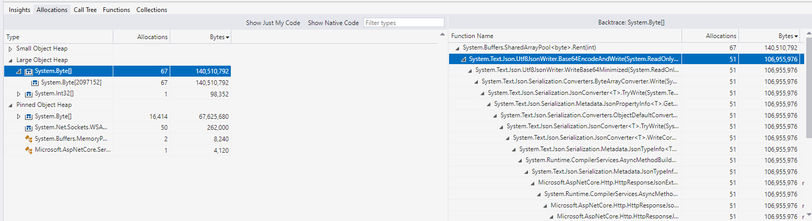
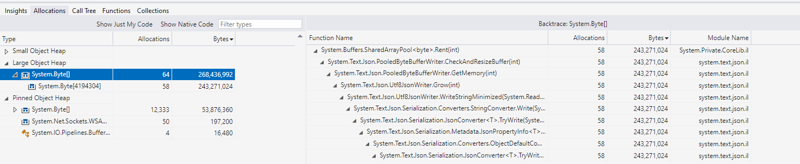
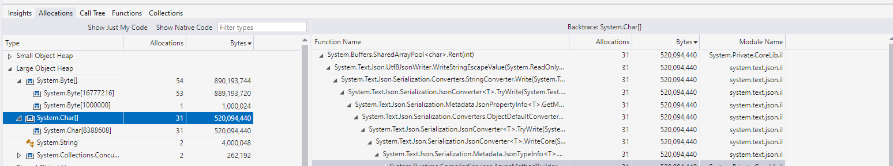
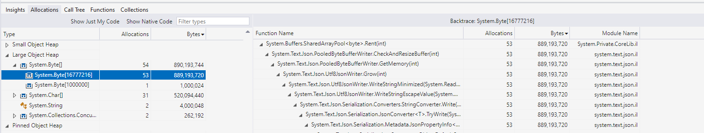

# Serializing large values with System.Text.Json lead to large memory allocations in LOH

## Large byte arrays to base-64 encoding

```sh
.\bombardier.exe -l -n 1000 -c 50 http://localhost:5174/binary
```

```sh
Bombarding http://localhost:5174/binary with 1000 request(s) using 50 connection(s)
 1000 / 1000 [=======================================================================================] 100.00% 807/s 1s
Done!
Statistics        Avg      Stdev        Max
  Reqs/sec       895.44     407.18    2279.08
  Latency       56.62ms    29.88ms   209.70ms
  Latency Distribution
     50%    41.95ms
     75%    61.32ms
     90%    88.42ms
     95%   182.32ms
     99%   206.17ms
  HTTP codes:
    1xx - 0, 2xx - 1000, 3xx - 0, 4xx - 0, 5xx - 0
    others - 0
  Throughput:     1.07GB/s
```



## Large string with no escaped characters

```sh
.\bombardier.exe -l -n 1000 -c 50 http://localhost:5174/string
```

```sh
Bombarding http://localhost:5174/string with 1000 request(s) using 50 connection(s)
 1000 / 1000 [======================================================================================] 100.00% 1380/s 0s
Done!
Statistics        Avg      Stdev        Max
  Reqs/sec      2066.66    1692.96    6846.19
  Latency       30.68ms    15.60ms   202.43ms
  Latency Distribution
     50%    22.20ms
     75%    25.28ms
     90%    61.26ms
     95%    89.86ms
     99%   143.50ms
  HTTP codes:
    1xx - 0, 2xx - 1000, 3xx - 0, 4xx - 0, 5xx - 0
    others - 0
  Throughput:     1.49GB/s
```



## Large string with escaped characters

```sh
.\bombardier.exe -l -n 1000 -c 50 http://localhost:5174/escaped-string
```



```sh
Bombarding http://localhost:5174/escaped-string with 1000 request(s) using 50 connection(s)
 1000 / 1000 [=======================================================================================] 100.00% 253/s 3s
Done!
Statistics        Avg      Stdev        Max
  Reqs/sec       275.26     255.74    1654.64
  Latency      184.30ms    68.00ms   466.25ms
  Latency Distribution
     50%   168.10ms
     75%   207.65ms
     90%   270.62ms
     95%   368.58ms
     99%   429.57ms
  HTTP codes:
    1xx - 0, 2xx - 1000, 3xx - 0, 4xx - 0, 5xx - 0
    others - 0
  Throughput:     1.08GB/s
```



