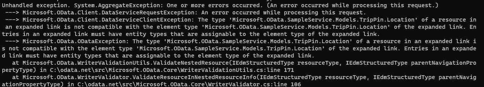

# Race condition leads to duplicate EDM types, which leads to validation error

This experiment reproduces this GitHub issue: https://github.com/OData/odata.net/issues/2532 affect Microsoft.OData.Client 7.12.4 (latest version at the time of writing).

This is a sporadic issue, and it's hard to reproduce. You may need to run the sample program multiple times for it surface. But if you run it enough times, you might see an error like the following



To run the program, change to the `ODataClientDuplicateEdmTypeRaceCondition` directory and run: 

```
dotnet run -c Release
```

In my case, to reproduce the issue more consistently, I reference my local copies of `Microsoft.OData.Client` project and added calls to `Thread.Sleep()` in `ClientEdmModel.GetOrCreateEdmTypeInternal`. In particular, I added the `Thread.Sleep()` before acquiring the lock to insert the created edm type in `edmTypeClrTypeCache` if the thread successfully inserted the entry in the `clrTypeToTypeAnnotationCache`.

Here's an excerpt of what the changes I made look like:

In `ClientEdmModel.GetOrCreateClientTypeAnnotation` method, I added an out parameter
to indicated whehter the thread inserted the item in the cache:

```diff
-private ClientTypeAnnotation GetOrCreateClientTypeAnnotation(IEdmType edmType, Type type)
+private ClientTypeAnnotation GetOrCreateClientTypeAnnotation(IEdmType edmType, Type type, out bool insertedEntry)
{
    ClientTypeAnnotation clientTypeAnnotation;
    string qualifiedName = type.ToString();
+    insertedEntry = false;
    // all that are not built-in types need to be cached: enum, complex, entity
    if (edmType.TypeKind == EdmTypeKind.Enum || edmType.TypeKind == EdmTypeKind.Complex || edmType.TypeKind == EdmTypeKind.Entity)
    {
        lock (this.typeNameToClientTypeAnnotationCache)
        {
            // ... redacted
            if (clientTypeAnnotation == null)
            {
+                insertedEntry = true;
                clientTypeAnnotation = new ClientTypeAnnotation(edmType, type, qualifiedName, this);
                this.typeNameToClientTypeAnnotationCache.Add(qualifiedName, clientTypeAnnotation);
            }
            else
            {
                // redacted ...
            }
        }
    }
    else
    {
        // redacted ...
    }

    return clientTypeAnnotation;
}
```

In the `CLientEdmModel.GetOrCreateEdmTypeInternal` I call `Thread.Sleep` if the entry was inserted in the first cache, before acquiring the lock for the second cache:

```diff
private EdmTypeCacheValue GetOrCreateEdmTypeInternal(IEdmStructuredType edmBaseType, Type type, PropertyInfo[] keyProperties, bool isEntity, bool? hasProperties)
{
    // redacted ..

    if (cachedEdmType == null)
    { 
        // redacted...

        IEdmType edmType = cachedEdmType.EdmType;
-        ClientTypeAnnotation clientTypeAnnotation = this.GetOrCreateClientTypeAnnotation(edmType, type);        
+        ClientTypeAnnotation clientTypeAnnotation = this.GetOrCreateClientTypeAnnotation(edmType, type, out bool insertedInTypeAnnotationCache);
        this.SetClientTypeAnnotation(edmType, clientTypeAnnotation);

        // redacted...
        
        if (insertedInTypeAnnotationCache)
        {
            if (type.Name.Contains("Location"))
            {
                Thread.Sleep(5000);
            }

            if (type.Name.Contains("Person"))
            {
                Thread.Sleep(1000);
            }
        }

        lock (this.clrToEdmTypeCache)
        {
            EdmTypeCacheValue existing;
            if (this.clrToEdmTypeCache.TryGetValue(type, out existing))
            {
                cachedEdmType = existing;
            }
            else
            {
                this.clrToEdmTypeCache.Add(type, cachedEdmType);
            }
        }
    }

    return cachedEdmType;
}

```

With those changes, I was able to reproduce the error consistently with almost every run of the program.

The root cause of the issue that the `clrToEdmTypeCache` and the `typeNameToClientTypeAnnotationCache` dictionaries in the `ClientEdmModel` end up storing different instances of `EdmComplexTypeWithDelayLoadedProperties` which represent the same `Microsoft.OData.SampleService.Models.TripPin.Location` complex type. The two dictionaries are plain `Dictionary` instances (i.e. not thread-safe `ConcurrentDictionary`), but there are locks that ensures no two threads modify either dictionary at the same time. We can replace them with `ConcurrentDictionary`, but that won't resolve this issue.

The issue is that when two threads call this method concurrently with the same `Type` as input, they will both independently create an edm type representing the clr type (assuming this is a complex type or entity type). Each thread will try to insert the edm type in the caches if it doesn't exist. The thread that acquires the lock to the first cache first, will get to insert the item in the first cache. However, because this thread releases the lock, it's not guaranteed to be the first one to acquire the lock to the second cache. Here's a sample sequence of events to illustrate the issue further:

```
Thread1 creates instance of EdmComplexTypeWithDelayLoadedProperties (address 0x1)
    Thread2 creates instance of EdmComplexTypeWithDelayLoadedProperties (address 0x2)
Thread1 attempts to acquire lock to typeNameToClientTypeAnnotationCache
Thread1 acquires lock to typeNameToClientTypeAnnotationCache
Thread1 checks if edm type is in typeNameToClientAnnotationCache and does not find it
Thread1 inserts 0x1 in typeNameToClientTypeAnnotationCache
    Thread2 attempts to acquire lock to typeNameToClientTypeAnnotationCache, but it's locked by Thread1
Thread1 releases lock to typeNameToClientTypeAnnotationCache
    Thread2 acquires lock to typeNameToClientTypeAnnotationCache
    Thread2 checks if edm type is in typeNameToClientAnnotationCache and finds there's already a match
    Thread2 releases lock to typeNameToClientTypeAnnotationCache
    Thread2 attempts to acquire lock to edmToClrTypeCache
    Thread2 acquires lock to edmToClrTypeCache
Thread1 attempts to acquire lock to edmToClrTypeCache but Thread2 already has it
    Thread2 checks if the edm type exists in the edmToClrTypeCache and does not find it
    Thread2 inserts edm tyoe 0x2 in edmToClrTypeCache
    Thread2 releases lock to edmToClrTypeCache
Thread1 acquires lock to edmToClrTypeCache
Thread1 checks if there's matching edm type in edmToClrTypeCache and finds there's a already a match
Thread1 releases lock to edmToClrTypeCache

The final outcome: instance 0x1 in typeNameToClienTypeAnnotationCache and 0x2 in edmToClrTypeCache
```

Of course, this event is rare, in most cases the same thread ends up acquiring both locks first. That's part of the reason the issue is not common, unless in high-traffic service.

There are other reasons the error is difficult to reproduce. It needs to occur the first time the types are inserted into the caches. If they're inserted into the caches without duplicate, then the issue will not occur again until you reboot the service. This is because the `ClientEdmModel` is shared across all `DataServiceContext` instances using the same OData version, and is stored in a static cache. This also implies that the issue can occur even if requests are using different instances of `DataServiceContext`.

Also, some requests will hold a lock to the type before loading properties. For example, an `ExecuteAsync` request against an entity set, calls `BuildPropertyCache` somewhere in its call chain, this method will acquire a lock to the entity type in the type annotation cache and trigger a call to load all properties (which calls `GetOrCreateEdmType` on each property if they have not yet been loaded). This if you run two requests on the same entity set, this will not result in the property types of the entity type being duplicated. But the entity types can be duplicated.

So to reproduce this particular issue, you should run requests against different types that have a common type on one or more of their properties. In this sample, I have two concurrent GET requests, one against that fetches an `AddressInfo` property directly (which is collection of `Location` objects), and another that fetches the `People` entity set (`Person` entity type has a property `AddressInfo`). The requests run concurrently on separate threads and can enter the `GetOrCreateEdmTypeInternal` at the same time, with `Location` type as input.

So far this explains how to get your service in a state where it has different instances representing the same type in the two caches. Now we have to relate this the exception that is being thrown.

The exception is being thrown in the `ODataWriter` when serializing a request body. The request body needs to have a nested resource (e.g. complex property) whose type has duplicate instances. That's why I added a request to create a new `Person` entity after completing the two GET requests.

When writing a nested resource (e.g. the value of a complex or navigation property), the writer calls `WriterValidator.ValidateResourceInNestedResourceInfo(resourceType, parentNavigationPropertyType)` which checks whether the resource type (of the object being serialized) matches the type of the property it's being serialized in. The validation compares the resource type and its base types to the property type using the `IsEquivalentTo` extension method to find a match. It uses `Object.ReferenceEquals()` to compare them, so the types have to be the exact same instance in memory, otherwise it will return false and the exception will be thrown.

The writer gets the resource type of the object by calling `TypeNameOracle.ResolveAndValidateTypeName` method, which tries to find the EDM type in the model based on the type name. Note that the model used is the `ClientEdmModel`, not the model that was passed to the `DataServiceContext`. This eventually calls `ClientEdmModel.FindDeclaredType()` which retrieves the EDM type from the `ClientEdmModel.typeNameToClientAnnotationCache`.

The writer gets the type of the property from the parent scope. In this case, the parent scope should be a `NestedResourceInfoScope`. The EDM type can be retrieved from `Scope.ResourceType` or `Scope.ItemType`. For this kind of scope, the type is set in the `ODataWriterCore.CheckForNestedResourceInfoWithContent` method. It finds the corresponding property with `ParentResourceType.FindProperty()`, then gets the type of that property. The `ParentResourceType` in this case is an `EdmEntityTypeWithDelayLoadedProperties` instance that corresponds to the entity type that owns the property (`Person` in this example). The `FindProperty` of this class returns the properties that created by the `delayLoadEntityProperties` callback in `GetOrCreateEdmTypeInternal()`. This uses `CreateEdmProperty()` which in turn calls `GetOrCreateEdmType()` which returns the type stored in the `ClientEdmModel.clrToEdmTypeCache`.

Therefore, the `WriteValidator.ValidateResourceInNestedResourceInfo` is called with inputs coming from `typeNameToClientAnnotationCache` and `clrToEdmTypeCache`. If these two inputs happen to be different instances, then the exception is thrown.

I think one easy fix that is least disruptive is to update the logic in `GetOrCreateEdmTypeInternal` to ensure the thread that acquires the inserts the type in the first cache also inserts in the second cache before releasing the lock. Later on, we can investigate a better design that will avoid these kinds of issues (see also https://github.com/OData/odata.net/issues/2321).