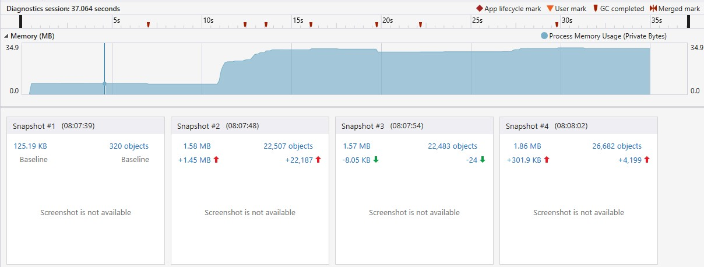
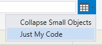
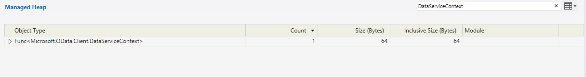
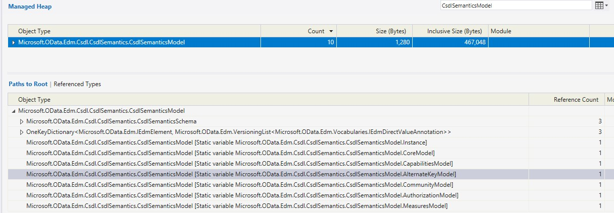
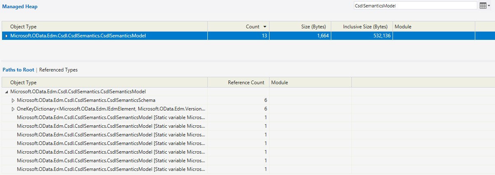
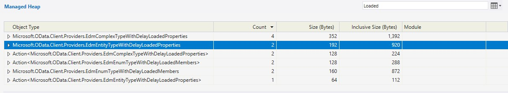

# EDM Model memory leaks in OData Client due to static caches

This experiment demonstrates memory leaks of EDM model instances and/or associated schema comments that can occur in OData Client due to static caches. The underlying issue is explained in more detail [here](https://github.com/OData/odata.net/issues/2321).

The profiler reports used for this demonstration are stored in this repo:
- The `CsdlSemanticsModel`-based report is stored in the [`CsdlSemanticsModelMemoryUsageReport.diagsesson` file](./CsdlSemanticsModelMemoryUsageReport.diagsession)
- The `EdmModel`-based report is stored in the [`EdmModelMemoryUsageReport.diagsesson` file](./EdmModelMemoryUsageReport.diagsession)

You can open those files in Visual Studio to follow along, or create your own reports using the steps below.

PS: The reports were created in Visual Studio 2019.

## Running the experiment
The experiment program should be launched with the Memory Usage profiler in Visual Studio: Open the solution in Visual Studio -> Click the **Debug** menu -> **Performance Profiler** -> Select **Memory Usage** -> Click **Start** to launch the program.

PS: Configure your app to run in **Release** for more accurate results.

When you run the experiment, it first asks to choose between `EdmModel` and `CsdlSemanticsModel`. If you pick `EdmModel`, the models will be created programmatically using the OData `ModelBuilder`. If you select `CsdlSemanticsModel`, the models will be parsed from an XML CSDL file using `CsdlReader`. For this demonstration, the experiment was executed twice, once with `CsdlSemanticsModel` and once with `EdmModel`.

Then the app will perform the following steps:
- Execute 3 OData requests against the service to fetch people and display their names.
- Run a garbage collection
- Execute the same 3 requests again.

For each request, it will create a new temporary `DataServiceContext` and a new  `IEdmModel` passed to it.

The app will pause at a few checkpoints to prompt you to take a memory snapshot:
- Before making the first batch of requests so that you can take a baseline snapshot
- After the first 3 requests but before GC
- After the GC so we can get an idea of which objects are cleaned by GC and which remain
- After the second batch of 3 requests so that we can observe memory usage for model elements continue to grow despite of GC

We have an explicit call to `GC.Collect()` to ensure that garbage-collection runs. However, it's possible that one or more garbage collections will have already executed by then. This could make the results of the first snapshot less reproducible (e.g. the `DataServiceContext` instances may already be removed from memory by the time the second memory snapshot is taken)

Once completed the profiler will show a report like:

## Analyzing the reports

### `CsdlSemanticsModel` version

Let's start with the `CsdlSemanticsModel`-based report. Let's open the 2nd snapshot's detailed view (click the link that shows the total number of objects on the heap). To make the search more accurate, let's remove the default filter's if they're applied:
- Click the drop-down that has a table icon on the top-right of the heap view
- De-select both the **Just My Code** and **Collapse small objects** filter options

Now, let's search for `DataServiceContext` in the filter box. The results here may vary depending on whether or not garbage collections occurred after making the requests and before taking the snapshot. In my case, that was the case. Garbage collection is indicated by the red markers on top of the timeline of the overall report.

In my case there are no instances of `Microsoft.OData.Client.DataServiceContext` remaining, but if garbage collection did not occur, you should see 3 instances.

Now let's search for `CsdlSemanticsModel`:

We have 10 instances of `CsdlSemanticsModel`. We only created 3 instances, where did the remaining 7 come from?

There 7 built-in models that are created once and stored in static propertes in the `VocabularyModelProvider` internal static class. These correspond the built-in vocabulary models that are referenced by all other models that you create. If you click the object type in the upper table view, you can see the **Paths too Root**. These 7 models are easily identified with the *Static variable* label inside the square brackets. The entry should ideally display the class where the property is defined, e.g. `Microsoft.OData.Edm.Vocabularies.V1.VocabularyModelProvider.CoreModel`, instead it redundantly displays the type of the property `Microsoft.OData.Edm.Csdl.CsdlSemanics.CsdlSemanticsModel.CoreModel`. This is a bug in VS 2019 profiler and might already be fixed in VS 2022 or later versions.

The `...CdslSemanticsModel.Instance` model corresponds to the `ValidationModel`. It's also referenced by the `ValidationVocabularyModel.Instance` static property. It appears that when the same instance is referenced by multiple static properties, the profiler displays the most recent property to access the object as the root.

The remaining 3 instances are the ones we parsed from the service's CSDL. Finding the GC roots of these instances is trickier. If we expand the nodes we will notice that most of the paths are cyclic. We have to sift through a lot of "useless" paths to find the ones that actually lead to a root. This is a [known issue](https://developercommunity2.visualstudio.com/t/Memory-Performance-profiler-add-option/596683) and currently there seems to be no alternatives to manually expanding all the paths. If there's a `DataServiceContext` still in memory, then one of the roots will be `DataServiceClientFormat.serviceModel`. Whether or not there was a garbage collection, there will be 2 other roots:
- `DataServiceContext.ClientEdmModelCache.modelCache` static variable
- `EdmTypeSemantics.baseTypeCache` static variable

Now let's open the 3rd snapshot. This occurs after garbage collection. There should be no `DataServiceContext` instances left. There will still be 10 instances of `CsdlSemanticsModel`. The 3 instances we created are still kept alive by the 2 static roots highlighted above.

Now let's open the 4th snapshot. If garbage collection occured before this snapshot (it likely that it did), then there will be no instances of `DataServiceContext`. However, there are now 13 instances of `CsdlSemanticsModel`, 3 more instances have been added from the 3 requests.

Other types that could be interesting to look at are the EDM types created and cached by the `ClientEdmModel`. This creates and caches an instance of `EdmEntityTypeWithDelayLoadedProperties` provide a matching EDM type for a target CLR type when materializing a response. These also remain in memory throughout the application's lifetime since the `ClientEdmModel` instance itself is cached in the `ClientEdmModelCache.modelCache`. It's not clear why the `ClientEdmModel` creates these EDM types if it already have access to the corresponding EDM types from the service model. In fact the EDM types from the service model are cached in the `ClientEdmModel.EdmStructuredSchemaElements`.

For example, there are 2 instances of `EdmEntityTypeWithLoadedProperties` and 4 of `EdmComplexTypeWithLoadedProperties`.

It appears to me that the current implementation of the client might not be as suitable when in scenarios where the client is interacting with multiple OData services or in scenarios where models are short-lived (the latter is admittedly not a rare use-case).
