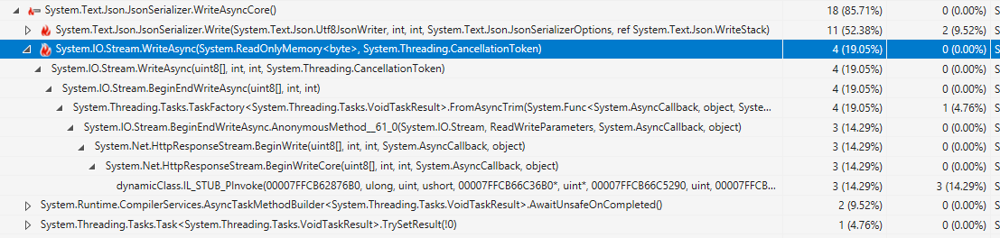
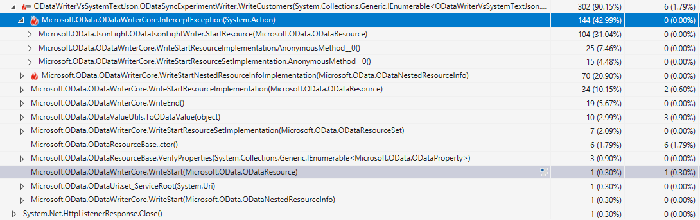
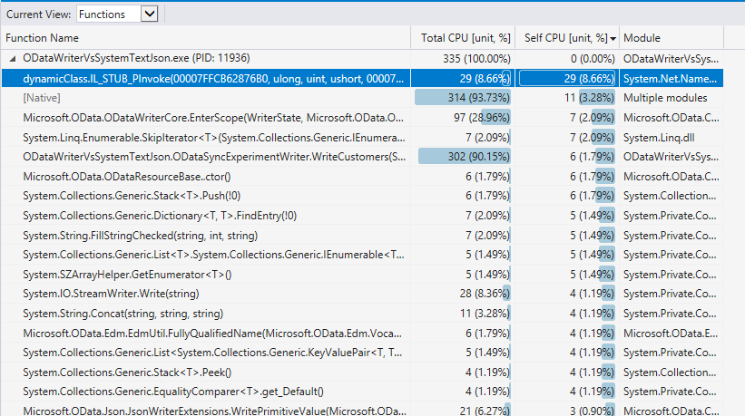
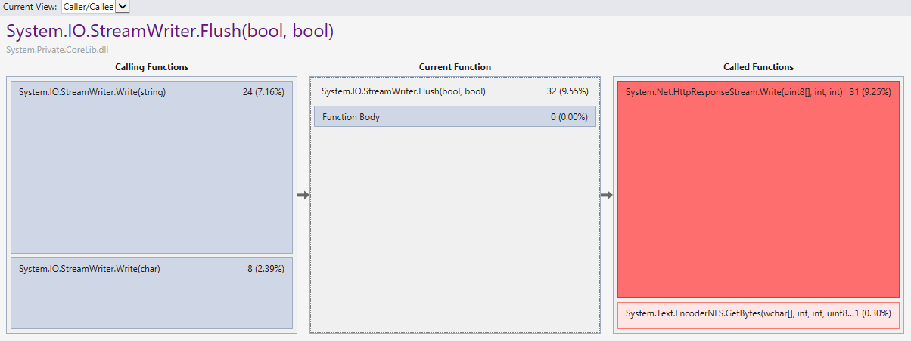
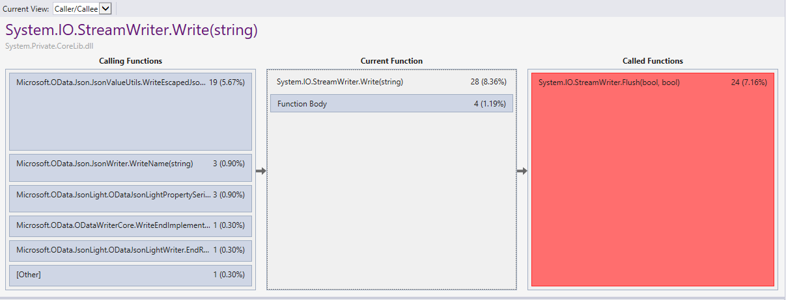
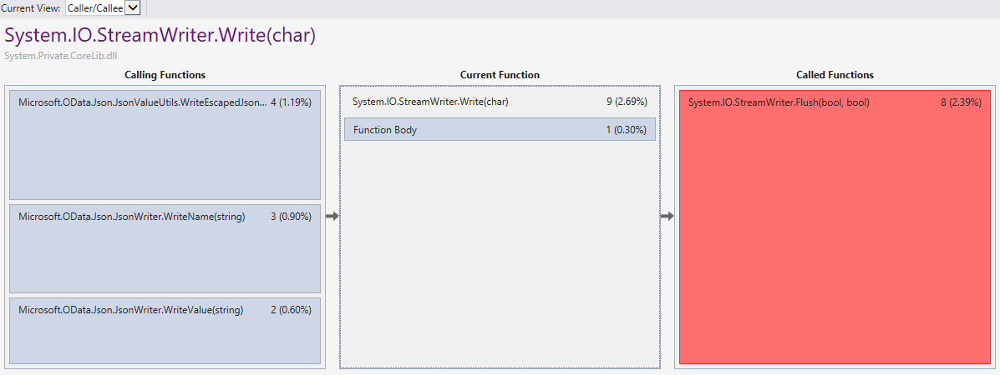
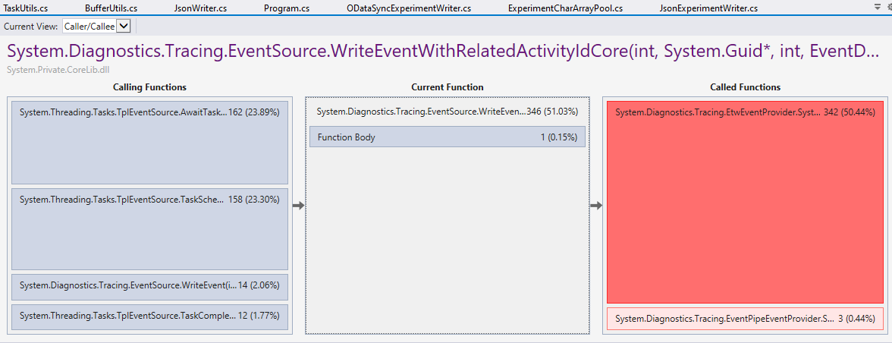

# ODataWriter vs System.Text.Json performance

- [Overview](#overview)
- [Project Setup](#project-setup)
- [Running Experiments](#running-experiments)
  * [Benchmarks](#benchmarks)
  * [Comparing Http Server Response Times](#comparing-http-server-response-times)
  * [CPU Profiling](#cpu-profiling)
- [Comparing Implementations](#comparing-implementations)
- [Conclusion](#conclusion)

## Overview

This experiment compares the performance differences between `JsonSerializer` (`System.Text.Json`) and `ODataWriter`. It's a follow up to [this issue](https://github.com/OData/WebApi/issues/2444)

The experiments are based on serializing a collection of [Customer](./ODataWriterVsSystemTextJson/ODataWriterVsSystemTextJson/DataModel.cs) entities.

There's an [`IExperimentWriter`](./ODataWriterVsSystemTextJson/ODataWriterVsSystemTextJson/IExperimentWriter.cs) interface that abstracts writing a collection of `Customer`s to a stream. And we compare 3 implementations:
- [`JsonExperimentWriter`](./ODataWriterVsSystemTextJson/ODataWriterVsSystemTextJson/JsonExperimentWriter.cs) based on `JsonSerializer.SerializeAsync`
- [`ODataExperimentWriter`](./ODataWriterVsSystemTextJson/ODataWriterVsSystemTextJson/ODataExperimentWriter.cs) based on an asynchronous `ODataWriter`. This simulates the steps taken by WebApi's `ODataResourceSetSerializer` to serialize an entity set response.
- [`ODataSyncExperimentWriter`](./ODataWriterVsSystemTextJson/ODataWriterVsSystemTextJson/ODataExperimentWriter.cs) based on a synchronous `ODataWriter`. Similar to `ODataExperimentWriter` but uses synchronous write methods instead of async.

The experiments compare writing to a memory stream, writing to a file as well as writing a http response from a simple server. The purpose of this is to account for potential I/O overhead that may affect the metrics.

The HTTP servers are based on a simple class ([ExperimentServer](./ODataWriterVsSystemTextJson/ODataWriterVsSystemTextJson/ExperimentServer.cs)) that takes an `IExperimentWriter` as input and sends a collection of `Customer`s as response to all requests.

## Project setup

The main project includes `Microsoft.OData.Core` and `Microsoft.OData.Edm` as project references. So for the solution to build, you need have a local copy of the [odata.net](https://github.com/OData/odata.net) repo and add the project references in Visual Studio.

## Running experiments

### Benchmarks

There are some benchmarks that compare the 3 serializers across different data sizes and destinations.

To run them: 
- In the `Main` method of the project, make sure the `RunBenchmarks()` method is
uncommented, and comment out all the remaining statements in the method.
- Then in your terminal, navigate to the directory that contains the `.csproj` file and run:

```
dotnet run -c Release -- --filter *
```

Here are some sample results

|             Method |        Job | UnrollFactor | dataSize |       Mean |       Error |      StdDev |     Median | Ratio | RatioSD |      Gen 0 |     Gen 1 |    Gen 2 |    Allocated |
|------------------- |----------- |------------- |--------- |-----------:|------------:|------------:|-----------:|------:|--------:|-----------:|----------:|---------:|-------------:|
|          WriteJson | DefaultJob |           16 |     1000 |   1.988 ms |   0.0302 ms |   0.0268 ms |   1.995 ms |  1.00 |    0.00 |   109.3750 |  109.3750 | 109.3750 |    525.52 KB |
|         WriteOData | DefaultJob |           16 |     1000 |  59.668 ms |   1.1631 ms |   1.6681 ms |  59.344 ms | 29.89 |    1.19 |  5000.0000 |         - |        - |  24490.41 KB |
|     WriteODataSync | DefaultJob |           16 |     1000 |  39.740 ms |   0.5698 ms |   0.4448 ms |  39.915 ms | 20.01 |    0.43 |  4923.0769 |  153.8462 |  76.9231 |  20595.88 KB |
|                    |            |              |          |            |             |             |            |       |         |            |           |          |              |
|      WriteJsonFile | Job-ABHABG |            1 |     1000 |   3.771 ms |   0.3180 ms |   0.8917 ms |   3.494 ms |     ? |       ? |          - |         - |        - |     98.05 KB |
|     WriteODataFile | Job-ABHABG |            1 |     1000 |  64.677 ms |   2.2464 ms |   6.5173 ms |  63.439 ms |     ? |       ? |  5000.0000 |         - |        - |  23937.82 KB |
| WriteODataSyncFile | Job-ABHABG |            1 |     1000 |  57.521 ms |   2.1010 ms |   6.0281 ms |  56.991 ms |     ? |       ? |  4000.0000 | 1000.0000 |        - |  20088.62 KB |
|                    |            |              |          |            |             |             |            |       |         |            |           |          |              |
|          WriteJson | DefaultJob |           16 |     5000 |   9.479 ms |   0.1632 ms |   0.1526 ms |   9.418 ms |  1.00 |    0.00 |   828.1250 |  718.7500 | 718.7500 |    4068.3 KB |
|         WriteOData | DefaultJob |           16 |     5000 | 236.482 ms |   3.0738 ms |   2.8753 ms | 236.680 ms | 24.95 |    0.48 | 28000.0000 | 1000.0000 |        - | 121955.65 KB |
|     WriteODataSync | DefaultJob |           16 |     5000 | 210.549 ms |   4.0937 ms |   4.0206 ms | 210.272 ms | 22.22 |    0.62 | 24000.0000 |         - |        - | 104437.29 KB |
|                    |            |              |          |            |             |             |            |       |         |            |           |          |              |
|      WriteJsonFile | Job-ABHABG |            1 |     5000 |  15.386 ms |   0.9091 ms |   2.6520 ms |  14.725 ms |     ? |       ? |          - |         - |        - |    410.66 KB |
|     WriteODataFile | Job-ABHABG |            1 |     5000 | 341.139 ms |  24.7906 ms |  69.9224 ms | 322.275 ms |     ? |       ? | 28000.0000 | 2000.0000 |        - | 119509.02 KB |
| WriteODataSyncFile | Job-ABHABG |            1 |     5000 | 275.562 ms |   8.6091 ms |  25.1130 ms | 275.487 ms |     ? |       ? | 24000.0000 | 1000.0000 |        - | 100345.96 KB |
|                    |            |              |          |            |             |             |            |       |         |            |           |          |              |
|          WriteJson | DefaultJob |           16 |    10000 |  18.647 ms |   0.2563 ms |   0.2398 ms |  18.706 ms |  1.00 |    0.00 |   937.5000 |  750.0000 | 750.0000 |      8149 KB |
|         WriteOData | DefaultJob |           16 |    10000 | 908.103 ms | 112.1642 ms | 330.7187 ms | 867.588 ms | 26.70 |    2.52 | 55000.0000 | 2000.0000 |        - | 243963.89 KB |
|     WriteODataSync | DefaultJob |           16 |    10000 | 699.142 ms |  31.6311 ms |  87.1212 ms | 690.979 ms | 37.54 |    2.97 | 49000.0000 |         - |        - | 208854.99 KB |
|                    |            |              |          |            |             |             |            |       |         |            |           |          |              |
|      WriteJsonFile | Job-ABHABG |            1 |    10000 |  34.629 ms |   1.6557 ms |   4.8558 ms |  32.933 ms |     ? |       ? |          - |         - |        - |    816.33 KB |
|     WriteODataFile | Job-ABHABG |            1 |    10000 | 704.676 ms |  39.3033 ms | 112.1344 ms | 673.265 ms |     ? |       ? | 55000.0000 | 2000.0000 |        - | 238992.23 KB |
| WriteODataSyncFile | Job-ABHABG |            1 |    10000 | 621.102 ms |  36.1759 ms | 105.5269 ms | 601.100 ms |     ? |       ? | 49000.0000 | 1000.0000 |        - | 200667.64 KB |


The benchmarks include scenarios for writing to a memory stream (`WriteJson`, `WriteOData` and `WriteODataSync`) as well as writing to a local temp file (`WriteJsonFile`, `WriteODataFile`, `WriteODataSyncFile`). I also have commented out scenarios based on http requests to a simple local server, but when running those, the ODataWriter-based serializers would hang at some point and throw a TaskCancelled exception. I'm not sure what causes this.

Anyway, from the results above, we clearly see that the JsonSerializer is around 15x-20x faster than the `ODataWriter`s regardless of whether we're writing to a file or memory or data size.

It is expected that for a single request, `WriteODataSync` should perform better than `WriteOData` due to the extra async overhead in the async writers.

While this analysis primarily focusses on response time and CPU usage, we can see that the memory overhead is considerably greater in OData as well.

### Comparing Http Server response times

To compare the response time of http requests based on the different serializers, go to the `Main` method of the main project and uncomment the `TestServers()` statement and comment out the remaining statements in the method. Then run the application (preferrably in Release mode).

This will launch three local servers:
- JsonSerializer server on `http://localhost:8080`
- async ODataWriter server on `http://localhost:8081`
- synchronous ODataWriter server on `http://localhost:8082`

All the servers work exactly the same way, they only differ on the serializer used to write the response (see [ExperimentServer](ODataWriterVsSystemTextJson/ODataWriterVsSystemTextJson/ExperimentServer.cs)). By default, the server will send as a response a JSON collection of 5000 Customer entities. It also logs the response time on the console (**Note**: the response time is actually the time taken to write the response, it doesn't include the time taken to generate the data.). You can request a different data size by adding a `count` query option (e.g. `http://localhost:8080?count=10000`)

The first couple of requests take a bit of time (probably some warmup activities taking place). So you should make a couple of requests to each of the endpoints until the response times converge before you start comparing them.

Here are sample response times observed on my machine:


The JsonSerializer server about 10x faster than the synchronous OData server and at least 25x faster than the async OData server.

Note that comparing response times of single request gives us insights into the latency, but not scalability/throughput. It's expected that async will may result in slower response times for individual requests but improve overall scalability. However in this case, the JsonSerializer is also async (using the `SerializeAsync` method), so I believe this is a fair comparison and could also translate to throughput.

### CPU Profiling

I used the Visual Studio performance profile to drill down and try and find what the sources of the bottlenecks are. I used the profile to collect performance metrics on the 3 servers. I let the servers "warm up" by making a bunch of requests until the response times converged. The profiler session I used in the following analysis can be found in [SystemJsonVsODataWriterAsyncVsODataWriterSync.diagsession](SystemJsonVsODataWriterAsyncVsODataWriterSync.diagsession)

The following graph shows CPU usage during requests against the 3 servers. The tiny bump on the left is a request to the JsonSerializer server, the large bump in the middle is a request to the async OData server and the bump on the right is a request to synchronous OData server.


The JsonSerializer server took 21ms to complete the request. 18ms (85.71%) were spent in `JsonSerializer.WriteAsyncCore()`. 11ms (52.38%) are spent in `JsonSerializer.WriteCore()` and only 4ms (19.05%) are actually spent writing to underlying network stream (`Stream.WriteAsync()`). We also see that the majority of the stream writing, 3ms (14.29%) is spent the strange `dynamicClass.IL_STUB_PInvoke` method. Using ILSpy, I found that this a [stub defined in `Interop.HttpApi`](https://source.dot.net/#Microsoft.AspNetCore.Server.HttpSys/NativeInterop/HttpApi.cs,36) as:
```c#
[DllImport("httpapi.dll", SetLastError = true)]
internal unsafe static extern uint HttpSendResponseEntityBody(SafeHandle requestQueueHandle, ulong requestId, uint flags, ushort entityChunkCount, HTTP_DATA_CHUNK* pEntityChunks, uint* pBytesSent, Microsoft.Win32.SafeHandles.SafeLocalAllocHandle pRequestBuffer, uint requestBufferLength, NativeOverlapped* pOverlapped, void* pLogData);
```
I believe it's a stub that calls into a native method defined in `httpapi.dll` that handles the low level response transmission.




The asynchronous ODataWriter request took 678ms while the synchronous version took 335ms. I focussed my analysis on the synchronous version because the current implementation of the async ODataWriter consists of wrapping the synchronous calls with tasks. The async API is also currently in the process of being rewritten.  Also, the synchronous writer represents the best case ODataWriter and still performs poorly compared to the async JsonSerializer.

About 296ms (88.36%) were spent in the OData writer methods. It's a bit trickier to determine where the majority of the bottleneck is because the CPU time is scattered across so many methods and deep call trees:



Switching to the functions view to make it easier to spot the most dominant methods, I quickly noticed that 29ms (8.66%) is spent in the native http call. This accounted for only 3ms in the JsonSerializer case. Both serializers are writing about the same amount of data (OData payload context an @odata.context url property) but the OData serializer spends about 10x times in the native http stack. My suspicion is that this is due to the lack of buffering and frequent calls to StreamWriter.Write and flushing.



The following images show that underlying ODataWriter write methods end up calling either `StreamWriter.Write(string)` (28ms) or `StreamWriter.Write(char)` (9ms). In both methods, the majority of the time is actually spent flushing to the underlying stream (24ms/28ms for Write(string) and 8ms/9ms for Write(char)). So the amount of time the OData writer was spending flushing single characters to the http stream is twice the time JsonSerializer spent writing the entire payload to the stream. This indicates that there's a significant overhead associated with sending a single character to the stream and our frequent calls to the stream writer lead to lots of inefficiencies.






Another thing I quickly noticed from the functions view graph is that string concatenation accounted for 11ms (3.28%), which is also more than double the time the JsonSerializer spends writing to its stream.

So the flushing and string concatenation account for 48ms. I am curious to find out how the remaining 248ms are distributed: how much of that is spent in write-related activities, how much is spent in Edm-related activities, etc. But I haven't found the time to do that breakdown yet.

I also analyzed the CPU usage in the async OData server just to try understand why the response time in the async case is almost double that of the sync version if their implementations are largely identical. Could the async overhead be that significant? Well surprisingly, it seems that over 50% of CPU time was actually spent on event tracing. Apparently, the `Microsoft.OData.TaskUtils.FollowOnSuccessWithTask(this Task antecedentTask, Func<Task, Task> operation)` leads to event writes to the ETW (Event Tracing for Windows), which in this case seems to be quite expensive. I don't know why this happens, I haven't yet verified whether this consistently happens even when we're not attaching a profiler and I don't know if it has anything to do with the specific implementation of our `FollowOnSuccessWithTask`. But this needs to be investigated further.



## Comparing implementations

If we take another look at the JsonSerializer's call tree, we noticed that out of the 18ms spent in the `JsonSerializer.WriteCoreAsync` method, 11ms are spent in `JsonSerializer.Write` and only 4ms in `Stream.WriteAsync`. The `JsonSerializer.Write` method is (as the name suggests) a synchronous method. It does not write to the stream, instead it writes to a [buffered writer](https://source.dot.net/#System.Text.Json/PooledByteBufferWriter.cs) that rents buffers from the shared `ArrayPool` (avoids memory allocations). When the buffer [is about 90% full](https://source.dot.net/#System.Text.Json/System/Text/Json/Serialization/JsonSerializer.Write.Stream.cs,98) then it writes the buffer content to the stream. The buffered writer starts with an initial buffer size of [16k](https://source.dot.net/#System.Text.Json/System/Text/Json/Serialization/JsonSerializerOptions.cs,17) by default and is designed to not expand the buffer more than 4 times (expanding the buffer involves [renting a larger buffer from the pool and copying data from the old buffer](https://source.dot.net/#System.Text.Json/PooledByteBufferWriter.cs,126)). For reference, the source code of `JsonSerializer.WriteAsync` can be found [here](https://source.dot.net/#System.Text.Json/System/Text/Json/Serialization/JsonSerializer.Write.Stream.cs,85).

The JsonSerializer uses the [`Utf8JsonWriter`](https://source.dot.net/#System.Text.Json/System/Text/Json/Writer/Utf8JsonWriter.cs) to write the utf8-encoded JSON to the buffered writer. This writer is also designed not to allocate memory. It uses `Span<>` and `ReadOnlySpan<>` of `char` and `byte` instead of working with strings directly. When it needs to get a block of memory in order to write a string into, it either allocates an array on the stack using `stackalloc` (when the size < 256 bytes) or rents from the shared array pool. For example, when it needs to write a string property name or value, it first checks if the string needs to be escaped. If the string needs to escaped, then it will stackalloc or rent an array to store the escaped string into. The following excerpt from the code provides an example of this. I've annotated the code with comments and remove some debug assertions for better clarity. You can check the actual source [here](https://source.dot.net/#System.Text.Json/System/Text/Json/Writer/Utf8JsonWriter.WriteValues.String.cs,183).

```c#
private void WriteStringEscapeValue(ReadOnlySpan<char> value, int firstEscapeIndexVal)
{
    // this is later used to check whether the allocated block
    // is rented from the pool, so that it can be returned
    char[]? valueArray = null;

    // this determines the size to allocate for the escaped string
    // if it has found at least one character that needs to be escaped
    // (i.e. firstEscapeIndexVal >= 0), then it assumes that the
    // remaining characters could also be escaped and allocates
    // enough memory to store the characters if they were escaped.
    // In the worst case, escaping a 1-byte ASCII character could increase its size by 6x
    // (see: https://source.dot.net/#System.Text.Json/System/Text/Json/JsonConstants.cs,60)
    // So in the worst case, this length will be 6x the size of the input
    int length = JsonWriterHelper.GetMaxEscapedLength(value.Length, firstEscapeIndexVal);

    // the stackalloc threshold is 256
    // (see: https://source.dot.net/#System.Text.Json/System/Text/Json/JsonConstants.cs,54)
    // allocate the array on the stack if length <= 256 otherwise rent from pool
    Span<char> escapedValue = length <= JsonConstants.StackallocThreshold ?
        stackalloc char[length] :
        (valueArray = ArrayPool<char>.Shared.Rent(length));

    // copies the input string into the allocated array
    // escaping characters where necessary
    // this returns the actually size written because
    // the allocated array is likely larger than the actual length
    // of the escaped string
    JsonWriterHelper.EscapeString(value, escapedValue, firstEscapeIndexVal, _options.Encoder, out int written);

    // write the escaped string to the buffered writer's memory
    WriteStringByOptions(escapedValue.Slice(0, written));

    // return array if it was rented
    if (valueArray != null)
    {
        ArrayPool<char>.Shared.Return(valueArray);
    }
}
```

Another thing I have noticed is that there seems to be no method in the Utf8JsonWriter that takes an `object` parameter or returns an `object`. This probably helps prevents boxing of primitive values. If this is indeed the case, I'd be curious to know how it pull out values from the object being serialized without boxing.

Now let's look at the OData's `JsonValueUtils.WriteEscapedJsonStringValue` which accomplishes a similar purpose (it accounts for 22ms or 6.57% of CPU usage). I've also added some comments to the following code and removed
some error-checking statements.

```c#
internal static void WriteEscapedJsonStringValue(
    TextWriter writer,
    string inputString,
    ODataStringEscapeOption stringEscapeOption,
    Ref<char[]> buffer,
    ICharArrayPool bufferPool)
{
    int firstIndex;
    if (!JsonValueUtils.CheckIfStringHasSpecialChars(inputString, stringEscapeOption, out firstIndex))
    {
        // no characters to escape, write the string as-is
        writer.Write(inputString);
    }
    else
    {
        int inputStringLength = inputString.Length;

        // this gets a char[] buffer. If the bufferPool is not null,
        // the it rents an array (fixed BufferLength of 128) from the pool
        // if the bufferPool is null, the it allocates a new array
        // using new char[BufferLengh]
        buffer.Value = BufferUtils.InitializeBufferIfRequired(bufferPool, buffer.Value);
        int bufferLength = buffer.Value.Length;
        int bufferIndex = 0;
        int currentIndex = 0;

        // Let's copy and flush strings up to the first index of the special char
        while (currentIndex < firstIndex)
        {
            int subStrLength = firstIndex - currentIndex;

            Debug.Assert(subStrLength > 0, "SubStrLength should be greater than 0 always");

            // If the first index of the special character is larger than the buffer length,
            // flush everything to the buffer first and reset the buffer to the next chunk.
            // Otherwise copy to the buffer and go on from there.
            if (subStrLength >= bufferLength)
            {
                inputString.CopyTo(currentIndex, buffer.Value, 0, bufferLength);
                writer.Write(buffer.Value, 0, bufferLength);
                currentIndex += bufferLength;
            }
            else
            {
                WriteSubstringToBuffer(inputString, ref currentIndex, buffer.Value, ref bufferIndex, subStrLength);
            }
        }

        // start writing escaped strings
        // this goes through a loop of writing escaped characters to the
        // buffer then flushing the buffer to the writer whenever
        // the buffer fills up
        WriteEscapedStringToBuffer(writer, inputString, ref currentIndex, buffer.Value, ref bufferIndex, stringEscapeOption);

        // write any remaining chars to the writer
        if (bufferIndex > 0)
        {
            writer.Write(buffer.Value, 0, bufferIndex);
        }
    }
}

```

This method writes to the writer a lot, that accounts for 19/22ms. It allocates a buffer to store the escaped string, but the buffer might not be large enough, so flushes the content of the buffer to the stream, then resets the buffer to accept new characters. I don't think preallocating a buffer large enough to store the escaped string will result in noticeable performance gains if we still have to write flush that buffer to the stream after escaping it. I think the main gains from JsonSerializer comes from the fact that when we're writing to the writer's memory, it's in memory and not a stream.

We can see that the JsonWriter also uses an array pool. The `ICharArrayPool` is actually a custom interface defined in `Microsoft.OData.Buffers`. But there's no default implementation provided either in the core library or in WebApi. So it's not used in the WebApi's formatter. In principle, an array pool should be passed to the `ODataMessageWriterSettings.ArrayPool` property. When it's not provided, then `JsonWriter` simply allocates a new array when `BufferUtils.RentFromBuffer` is called. Using an actual pool here could save memory allocations and reduce GC pressure.

I also noticed that the `JsonValueUtils.CheckIfStringHasSpecialChars` method used in OData accounts for 2ms of CPU. It's a simple loop that goes through each character and returns at the first character that's in a character map of special characters. JsonSerializer uses an encoder to find the first special character, the default one is a highly optimized method that first tries to SIMD if supported then uses an unrolled loop when checking the remaining characters (see [source here](https://source.dot.net/#System.Text.Encodings.Web/System/Text/Encodings/Web/OptimizedInboxTextEncoder.cs,415)). While 2ms may not be that much on its own, I think this indicates that there are other areas where we could micro-optimize certain methods and the overall result could add up to noticeable improvements.

Another thing to note is that the `Utf8JsonWriter` can write utf8 bytes directly (JSON is based on utf-8). But C# `char`s are based on utf16. According to [this video](https://www.youtube.com/watch?v=gb3zcdZ-y3M), support utf8 directly does lead to better performance, but I don't know whether it would make a difference in our case.

## Conclusion

While we should expect the OData writer to be less performant than JsonSerializer because it simply has to do more work, I believe based on these findings that it's possible to gain noticeable performance improvements on ODataWriter without sacrificing the "OData expectations" (e.g. writing context urls and annotations, possible Edm validations, etc.).

Here are a couple of things that I think we should try in an effort to improve performance. Note that I have not yet tried any of them, so I'm not sure what type of gains we should expect or how effective they will be:

- Pass an `ICharArrayPool` to the `ODataMessageWriterSettings` when setting up the writer
- Consider using `Utf8JsonWriter` instead of our own `JsonWriter` if possible (Maybe this could result in public API changes? or adapters)
- Avoid frequent writes to the stream by using a buffered writer with a decently-sized buffer rented from an array pool
- Use highly-optimized BCL methods whenever possible instead of reinventing the wheel
- Scan our methods for micro-optimization opportunities like avoiding memory allocations, avoiding string concatenations, loop-unrolling, etc. wherever such optimizations could add up to decent performance gains