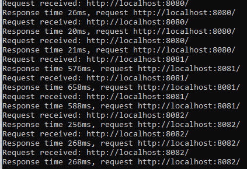

# ODataWriter vs System.Text.Json performance

- [Overview](#overview)
- [Project Setup](#project-setup)
- [Running Experiments](#running-experiments)
  * [Benchmarks](#benchmarks)
  * [Comparing Http Server Response Times](#comparing-http-server-response-times)
  * [CPU Profiling](#cpu-profiling)
- [Conclusions](#conclusions)

## Overview

This experiment compares the performance differences between `JsonSerializer` (`System.Text.Json`) and `ODataWriter`. It's a follow up to [this issue](https://github.com/OData/WebApi/issues/2444)

The experiments are based on serializing a collection of [Customer](./ODataWriterVsSystemTextJson/ODataWriterVsSystemTextJson/DataModel.cs) entities.

There's an `IExperimentWriter` interface that abstracts writing a collection of `Customer`s to a stream. And we compare 3 implementations:
- `JsonExperimentWriter` based on `JsonSerializer.SerializeAsync`
- `ODataExperimentWriter` based on an asynchronous `ODataWriter`. This simulates the steps taken by WebApi's `ODataResourceSetSerializer` to serialize an entity set response.
- `ODataSyncExperimentWriter` based on a synchronous `ODataWriter`. Similar to `ODataExperimentWriter` but uses synchronous write methods instead of async.

The experiments compare writing to a memory stream, writing to a file as well as writing a http response from a simple server. The purpose of this is to account for potential I/O overhead that may affect the metrics.

## Project setup

The main project includes `Microsoft.OData.Core` and `Microsoft.OData.Edm` as project references. So for the solution to build, you need have a local copy of the [odata.net](https://github.com/OData/odata.net) repo and add the project references in Visual Studio.

## Running experiments

### Benchmarks

There are some benchmarks that compare the 3 serializers across different data sizes and destinations.

To run them: 
- In the `Main` method of the project, make sure the `RunBenchmarks()` method is
uncommented, and comment out all the remaining statements in the method.
- Then in your terminal, navigate to the directory that contains the `.csproj` file and run:

```
dotnet run -c Release -- --filter *
```

Here are some sample results

|             Method |        Job | UnrollFactor | dataSize |       Mean |       Error |      StdDev |     Median | Ratio | RatioSD |      Gen 0 |     Gen 1 |    Gen 2 |    Allocated |
|------------------- |----------- |------------- |--------- |-----------:|------------:|------------:|-----------:|------:|--------:|-----------:|----------:|---------:|-------------:|
|          WriteJson | DefaultJob |           16 |     1000 |   1.988 ms |   0.0302 ms |   0.0268 ms |   1.995 ms |  1.00 |    0.00 |   109.3750 |  109.3750 | 109.3750 |    525.52 KB |
|         WriteOData | DefaultJob |           16 |     1000 |  59.668 ms |   1.1631 ms |   1.6681 ms |  59.344 ms | 29.89 |    1.19 |  5000.0000 |         - |        - |  24490.41 KB |
|     WriteODataSync | DefaultJob |           16 |     1000 |  39.740 ms |   0.5698 ms |   0.4448 ms |  39.915 ms | 20.01 |    0.43 |  4923.0769 |  153.8462 |  76.9231 |  20595.88 KB |
|                    |            |              |          |            |             |             |            |       |         |            |           |          |              |
|      WriteJsonFile | Job-ABHABG |            1 |     1000 |   3.771 ms |   0.3180 ms |   0.8917 ms |   3.494 ms |     ? |       ? |          - |         - |        - |     98.05 KB |
|     WriteODataFile | Job-ABHABG |            1 |     1000 |  64.677 ms |   2.2464 ms |   6.5173 ms |  63.439 ms |     ? |       ? |  5000.0000 |         - |        - |  23937.82 KB |
| WriteODataSyncFile | Job-ABHABG |            1 |     1000 |  57.521 ms |   2.1010 ms |   6.0281 ms |  56.991 ms |     ? |       ? |  4000.0000 | 1000.0000 |        - |  20088.62 KB |
|                    |            |              |          |            |             |             |            |       |         |            |           |          |              |
|          WriteJson | DefaultJob |           16 |     5000 |   9.479 ms |   0.1632 ms |   0.1526 ms |   9.418 ms |  1.00 |    0.00 |   828.1250 |  718.7500 | 718.7500 |    4068.3 KB |
|         WriteOData | DefaultJob |           16 |     5000 | 236.482 ms |   3.0738 ms |   2.8753 ms | 236.680 ms | 24.95 |    0.48 | 28000.0000 | 1000.0000 |        - | 121955.65 KB |
|     WriteODataSync | DefaultJob |           16 |     5000 | 210.549 ms |   4.0937 ms |   4.0206 ms | 210.272 ms | 22.22 |    0.62 | 24000.0000 |         - |        - | 104437.29 KB |
|                    |            |              |          |            |             |             |            |       |         |            |           |          |              |
|      WriteJsonFile | Job-ABHABG |            1 |     5000 |  15.386 ms |   0.9091 ms |   2.6520 ms |  14.725 ms |     ? |       ? |          - |         - |        - |    410.66 KB |
|     WriteODataFile | Job-ABHABG |            1 |     5000 | 341.139 ms |  24.7906 ms |  69.9224 ms | 322.275 ms |     ? |       ? | 28000.0000 | 2000.0000 |        - | 119509.02 KB |
| WriteODataSyncFile | Job-ABHABG |            1 |     5000 | 275.562 ms |   8.6091 ms |  25.1130 ms | 275.487 ms |     ? |       ? | 24000.0000 | 1000.0000 |        - | 100345.96 KB |
|                    |            |              |          |            |             |             |            |       |         |            |           |          |              |
|          WriteJson | DefaultJob |           16 |    10000 |  18.647 ms |   0.2563 ms |   0.2398 ms |  18.706 ms |  1.00 |    0.00 |   937.5000 |  750.0000 | 750.0000 |      8149 KB |
|         WriteOData | DefaultJob |           16 |    10000 | 908.103 ms | 112.1642 ms | 330.7187 ms | 867.588 ms | 26.70 |    2.52 | 55000.0000 | 2000.0000 |        - | 243963.89 KB |
|     WriteODataSync | DefaultJob |           16 |    10000 | 699.142 ms |  31.6311 ms |  87.1212 ms | 690.979 ms | 37.54 |    2.97 | 49000.0000 |         - |        - | 208854.99 KB |
|                    |            |              |          |            |             |             |            |       |         |            |           |          |              |
|      WriteJsonFile | Job-ABHABG |            1 |    10000 |  34.629 ms |   1.6557 ms |   4.8558 ms |  32.933 ms |     ? |       ? |          - |         - |        - |    816.33 KB |
|     WriteODataFile | Job-ABHABG |            1 |    10000 | 704.676 ms |  39.3033 ms | 112.1344 ms | 673.265 ms |     ? |       ? | 55000.0000 | 2000.0000 |        - | 238992.23 KB |
| WriteODataSyncFile | Job-ABHABG |            1 |    10000 | 621.102 ms |  36.1759 ms | 105.5269 ms | 601.100 ms |     ? |       ? | 49000.0000 | 1000.0000 |        - | 200667.64 KB |


The benchmarks include scenarios for writing to a memory stream (`WriteJson`, `WriteOData` and `WriteODataSync`) as well as writing to a local temp file (`WriteJsonFile`, `WriteODataFile`, `WriteODataSyncFile`). I also have commented out scenarios based on http requests to a simple local server, but when running those, the ODataWriter-based serializers would hang at some point and throw a TaskCancelled exception. I'm not sure what causes this.

Anyway, from the results above, we clearly see that the JsonSerializer is around 15x-20x faster than the `ODataWriter`s regardless of whether we're writing to a file or memory or data size.

It is expected that for a single request, `WriteODataSync` should perform better than `WriteOData` due to the extra async overhead in the async writers.

### Comparing Http Server response times

To compare the response time of http requests based on the different serializers, go to the `Main` method of the main project and uncomment the `TestServers()` statement and comment out the remaining statements in the method. Then run the application (preferrably in Release mode).

This will launch three local servers:
- JsonSerializer server on `http://localhost:8080`
- async ODataWriter server on `http://localhost:8081`
- synchronous ODataWriter server on `http://localhost:8082`

All the servers work exactly the same way, they only differ on the serializer used to write the response. By default, the server will send as a response a JSON collection of 5000 Customer entities. It also logs the response time on the console (**Note**: the response time is actually the time taken to write the response, it doesn't include the time taken to generate the data.). You can request a different data size by adding a `count` query option (e.g. `http://localhost:8080?count=10000`)

The first couple of requests take a bit of time (probably some warmup activities taking place). So you should make a couple of requests to each of the endpoints until the response times converge before you start comparing them.

Here are sample response times observed on my machine:



The JsonSerializer server about 10x faster than the synchronous OData server and at least 25x faster than the async OData server.

Note that comparing response times of single request gives us insights into the latency, but not scalability/throughput. It's expected that async will may result in slower response times for individual requests but improve overall scalability. However in this case, the JsonSerializer is also async (using the `SerializeAsync` method), so I believe this is a fair comparison and could also translate to throughput.

### CPU Profiling

TODO

## Conclusions

TODO