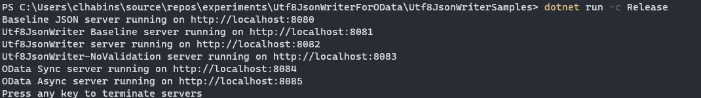
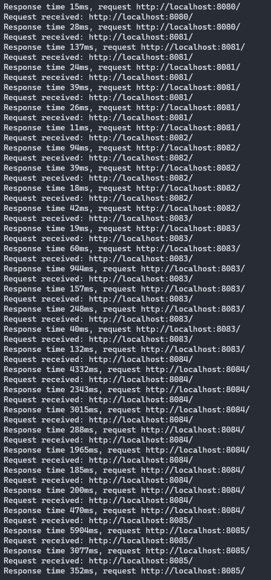

# Getting familiar with Utf8JsonWriter

This experment compares writing an OData response using the `ODataMessageWriter` vs using `Utf8JsonWriter` directly (i.e. without using `JsonSerializer`). The goal is to get acquainted with the `Utf8JsonWriter` APIs and settings and to get a sense of how `Utf8JsonWriter` could potentially be used by `ODataWriter` internally.

The experiments runs and compares a number of servers on different ports.
The servers return a JSON response of 5000 customer entities (which is probably overkill for a single response) and displays the time it took to process the response. This is meant to give a rough idea of how the different serializers compare, but it should be considered an authoriative performance test. Will conduct more thorough performance evaluations once I have a better idea of which approach to narrow down to:

| Port | Server serializer description |
-------|--------------|
8080 | Baseline server based on `JsonSerializer`
8081 | Serializes OData response using `Utf8JsonWriter` directly
8082 | Serialized OData response using message writer that mirrors the `ODataMessageWriter` API but uses `Utf8JsonWriter` internally
8083 | Similar to the previous server, except that internal `Utf8JsonWriter` is configured to skip validation
8084 | Uses the synchronous `ODataMessageWriter`
8085 | Uses the async `ODataMessageWriter`

The response times I recorded were flaky, I had to make a couple of requests for each endpoint before the response times stabilized. The "best" response times I observed for the `JsonSerializer` and the my custom serializers based on `Utf8JsonWriter` (i.e. ports 8080, 8081, 8082 and 8083) were comparable, ranging from 11ms - 20ms.

The best reponse times I recorded for the synchronous OData writer were just below 200ms. For the async writer I didn't get lower than 350ms.

Here are my take-aways:

## API

The API looks similar to OData's [`JsonWriter`](https://github.com/OData/odata.net/blob/master/src/Microsoft.OData.Core/Json/JsonWriter.cs).

- It contains methods for writing primitive properties in an object:
    - `WriteString(propertyName, value)`
    - `WriteNumber(propertyName, value)`
    - `WriteBoolean(propertyName, value)`
    - etc.
- methods for writiting primitive values in an array:
    - `WriteStringValue(value)`
    - `WriteNumberValue(value)`
    - etc.
- methods for starting object and array properties
    - `WriteStartObject(propertyName)`
    - `WriteStartArray(propertyName)`
- methods for starting object and array values:
    - `WriteStartObject()`
    - `WriteStartArray()`
- methods for closing arrays:
    - `WriteEndObject()`
    - `WriteEndArray()`

## Buffering

The `Utf8JsonWriter` writes directly to a buffer. It takes an optional [`IBufferWriter`](https://docs.microsoft.com/en-us/dotnet/api/system.buffers.ibufferwriter-1?view=net-6.0) as constructor argument. This where it writes to. the buffer writer exposes `GetMemory()` and `GetSpan()` functions that provides a buffer for the `Utf8JsonWriter` to write to, and an `Advance()` method used to tell the `IBufferWriter` how many bytes have been written to the memory buffer. To write the committed bytes to the output stream, you should `writer.Flush/Async()` method.

If you pass a `Stream` as argument instead of an `IBufferWriter`, the `Utf8JsonWriter` defaults to using an [`ArrayBufferWriter`](https://docs.microsoft.com/en-us/dotnet/api/system.buffers.arraybufferwriter-1?view=net-6.0) which backs the buffer with a heap-allocated array.

The `JsonSerializer` uses the internal [`PooledArrayBufferWriter`](https://source.dot.net/#Microsoft.AspNetCore.Mvc.ViewFeatures/PooledArrayBufferWriter.cs,75056dbb19cacf28) which rents buffers from the [`ArrayPool`](https://docs.microsoft.com/en-us/dotnet/api/system.buffers.arraypool-1?view=net-6.0) instead of allocating directly.

## Async support

The `Utf8JsonWriter` has **no direct support for asynchronous writing**. All writing is performed synchronously on the buffer memory. To send the written data to the stream, `Flush()` must be called, and this can be performed asynchronously using [`FlushAsync`](https://docs.microsoft.com/en-us/dotnet/api/system.text.json.utf8jsonwriter.flushasync?view=net-6.0#system-text-json-utf8jsonwriter-flushasync(system-threading-cancellationtoken)).

## Validation

The `Utf8JsonWriter` performs some validation by default to ensure you're writing compliant JSON. Things like writing a property or value at the wrong place will throw an exception. You can disable validation by passing a `JsonWriterOptions` options object to the constructor with the `SkipValidation` property set to `true`. This may improve performance.

## Keeping track of nested scope

The `Utf8JsonWriter` uses a bit stack (`struct BitStack`) to keep track of the current scope and wether it's currently inside an object or array. The bitstack is simply a `long` variable (64 bits) where each bit position represents a nesting level. Each bit value represents whether or not we're in an object or array. When you call `writer.WriteStartObject()` or `writer.WriteStartArray()` it writes an open brace (`{`) or bracket (`[`) and "pushes" a 1 or 0 to the bit stack: i.e. it increments the depth counter and sets the bit at that position to 1 or 0. If the depth exceeds 64 levels, extra bits are pushed into an `int[]` array, each element of the array can hold 32 values/levels before a going to the next element.

In OData's `JsonWriter` There's an actual Scope (`sealed class Scope`) stack `Stack<Scope>`. The `Scope` class maintains state about a particular nesting level, such as the scope type (array, object or "JSON padding function scope" which is used for `JSONP` support). I think this implementation has unnecessary abstractions for such a small number of scope types and can be optimized away.

At a higher-level, the `JsonSerializer` uses a custom `WriterStack` struct with a backing array to keep track of the writer's state stored in a `WriterStackFrame` struct. `ODataWriterCore` uses a custom `ScopeStack` backed by `List` stored in `Scope` class that maintains more complex metadata about the current state of the writer.

## Value conversion

Questions to answer:
- Does OData still need to support JSONP?