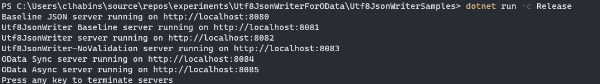
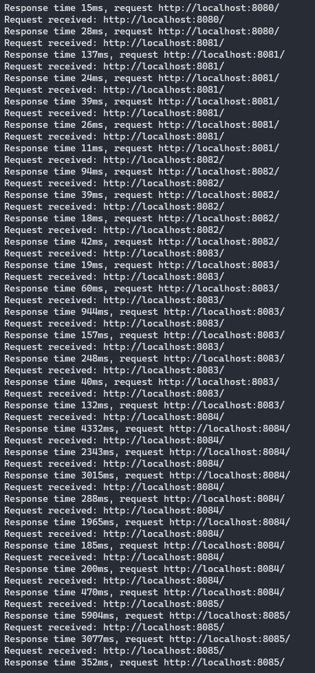

# Getting familiar with Utf8JsonWriter

This experment compares writing an OData response using the `ODataMessageWriter` vs using `Utf8JsonWriter` directly (i.e. without using `JsonSerializer`). The goal is to get acquainted with the `Utf8JsonWriter` APIs and settings and to get a sense of how `Utf8JsonWriter` could potentially be used by `ODataWriter` internally.

## Running the experiments:

*Note*: I added the OData libraries as direct project references to the solution. If you want to run this on your machine, you can update the location of the project references to match where you have stored the `Microsoft.OData.Core` project, or you can opt to get `Microsoft.OData.Core` from NuGet instead.

```
dotnet run -c Release
```

Open the solution in Visual Studio and run it from there.

The experiments runs and compares a number of servers on different ports.
The servers return a JSON response of 5000 customer entities (which is probably overkill for a single response) and displays the time it took to process the response. This is meant to give a rough idea of how the different serializers compare, but it should be considered an authoriative performance test. Will conduct more thorough performance evaluations once I have a better idea of which approach to narrow down to:



| Port | Server serializer description |
-------|--------------|
8080 | Baseline server based on `JsonSerializer`
8081 | Serializes OData response using `Utf8JsonWriter` directly
8082 | Serialized OData response using message writer that mirrors the `ODataMessageWriter` API but uses `Utf8JsonWriter` internally
8083 | Similar to the previous server, except that internal `Utf8JsonWriter` is configured to skip validation
8084 | Uses the synchronous `ODataMessageWriter`
8085 | Uses the async `ODataMessageWriter`

The response times I recorded were flaky, I had to make a couple of requests for each endpoint before the response times stabilized. The "best" response times I observed for the `JsonSerializer` and the my custom serializers based on `Utf8JsonWriter` (i.e. ports 8080, 8081, 8082 and 8083) were comparable, ranging from 11ms - 20ms.

The best reponse times I recorded for the synchronous OData writer were just below 200ms. For the async writer I didn't get lower than 350ms.



## Key take-aways

### API

The API looks similar to OData's [`JsonWriter`](https://github.com/OData/odata.net/blob/master/src/Microsoft.OData.Core/Json/JsonWriter.cs).

- It contains methods for writing primitive properties in an object:
    - `WriteString(propertyName, value)`
    - `WriteNumber(propertyName, value)`
    - `WriteBoolean(propertyName, value)`
    - etc.
- methods for writiting primitive values in an array:
    - `WriteStringValue(value)`
    - `WriteNumberValue(value)`
    - etc.
- methods for starting object and array properties
    - `WriteStartObject(propertyName)`
    - `WriteStartArray(propertyName)`
- methods for starting object and array values:
    - `WriteStartObject()`
    - `WriteStartArray()`
- methods for closing arrays:
    - `WriteEndObject()`
    - `WriteEndArray()`

### Buffering

The `Utf8JsonWriter` writes directly to a buffer. It takes an optional [`IBufferWriter`](https://docs.microsoft.com/en-us/dotnet/api/system.buffers.ibufferwriter-1?view=net-6.0) as constructor argument. This where it writes to. the buffer writer exposes `GetMemory()` and `GetSpan()` functions that provides a buffer for the `Utf8JsonWriter` to write to, and an `Advance()` method used to tell the `IBufferWriter` how many bytes have been written to the memory buffer. To write the committed bytes to the output stream, you should `writer.Flush/Async()` method.

If you pass a `Stream` as argument instead of an `IBufferWriter`, the `Utf8JsonWriter` defaults to using an [`ArrayBufferWriter`](https://docs.microsoft.com/en-us/dotnet/api/system.buffers.arraybufferwriter-1?view=net-6.0) which backs the buffer with a heap-allocated array.

The `JsonSerializer` uses the internal [`PooledArrayBufferWriter`](https://source.dot.net/#Microsoft.AspNetCore.Mvc.ViewFeatures/PooledArrayBufferWriter.cs,75056dbb19cacf28) which rents buffers from the [`ArrayPool`](https://docs.microsoft.com/en-us/dotnet/api/system.buffers.arraypool-1?view=net-6.0) instead of allocating directly. Why isn't the `PooledArrayBufferWriter` public? [This thread explains why the PooledArrayBufferWriter has not been made public](https://github.com/dotnet/runtime/issues/33598). Basically the .NET Team is concerned about the buffer being misused leading to corruption of the global shared pool and other extremely undesirable errors/behaviour.

### Async support

The `Utf8JsonWriter` has **no direct support for asynchronous writing**. All writing is performed synchronously on the buffer memory. To send the written data to the stream, `Flush()` must be called, and this can be performed asynchronously using [`FlushAsync`](https://docs.microsoft.com/en-us/dotnet/api/system.text.json.utf8jsonwriter.flushasync?view=net-6.0#system-text-json-utf8jsonwriter-flushasync(system-threading-cancellationtoken)).

Since writing happens in memory synchronously until he `Utf8JsonWriter` calls `Flush`. It's up to the caller to manually call `Flush` periodically.

The `JsonSerializer.SerializeAsync()` method calls the writer inside a loop to write a chunk of the payload to the buffer. Before each iteration it checks whether a "flush threshold" amount of bytes have been committed to the buffer, this threshold is 90% of the buffer size. The buffer size defaults to 16K.

In my sample program I flushed after every 66th iteration of the `foreach customer` loop. This amounts to roughly 14K bytes buffered before every flush, which is close to `JsonSerializer`'s defaults. I initially flushed after every iteration and placed a breakpoint just before the flush call. Using the debugger to inspect the `Utf8JsonWriter` just before the flush showed that 222 bytes were pending (i.e. buffered), 222 * 66 ~ 14K.

One of the key considerations we would have to make if we adopt the `Utf8JsonWriter` in OData is when to flush and it which level to abstract the flushing.
I don't think it would be a good idea to expose this to the user.

### Validation

The `Utf8JsonWriter` performs some validation by default to ensure you're writing compliant JSON. Things like writing a property or value at the wrong place will throw an exception. You can disable validation by passing a `JsonWriterOptions` options object to the constructor with the `SkipValidation` property set to `true`. This may improve performance.

This does not seem to perform duplicate key validation.

### Keeping track of nested scope

The `Utf8JsonWriter` uses a [bit stack (`struct BitStack`)](https://source.dot.net/#System.Text.Json/System/Text/Json/BitStack.cs,17cdc79d4f0fb216) to keep track of the current scope and wether it's currently inside an object or array. The bitstack is simply a `long` variable (64 bits) where each bit position represents a nesting level. Each bit value represents whether or not we're in an object or array. When you call `writer.WriteStartObject()` or `writer.WriteStartArray()` it writes an open brace (`{`) or bracket (`[`) and "pushes" a 1 or 0 to the bit stack: i.e. it increments the depth counter and sets the bit at that position to 1 or 0. If the depth exceeds 64 levels, extra bits are pushed into an `int[]` array, each element of the array can hold 32 values/levels before a going to the next element.

In OData's `JsonWriter` There's an actual [Scope (`sealed class Scope`) stack `Stack<Scope>`](https://github.com/OData/odata.net/blob/0bc9105b0e0e53f7e4b666e5422a82bad27c6036/src/Microsoft.OData.Core/Json/JsonWriter.cs#L36). The `Scope` class maintains state about a particular nesting level, such as the scope type (array, object or "JSON padding function scope" which is used for `JSONP` support). I think this implementation has unnecessary abstractions for such a small number of scope types and can be optimized away.

At a higher-level, the `JsonSerializer` uses a custom [`WriteStack`](https://source.dot.net/#System.Text.Json/System/Text/Json/Serialization/WriteStack.cs,22f25e53efb8201e) struct with a backing array to keep track of the writer's state stored in a `WriterStackFrame` struct. `ODataWriterCore` uses a custom [`ScopeStack`](https://github.com/OData/odata.net/blob/0bc9105b0e0e53f7e4b666e5422a82bad27c6036/src/Microsoft.OData.Core/ODataWriterCore.cs#L3670) backed by `List` stored in `Scope` class that maintains more complex metadata about the current state of the writer. What are the practical considerations for making a non-trivial like `ScopeStack` and `Scope` structs?, [we've had a similar discussion regarding ODataUri](https://github.com/OData/odata.net/issues/2163). It may be worthwhile to investigate whether this would be beneficial for OData.

### Value conversion

In OData core, the writers take `ODataResource`, `ODataResourceSet` and similer instances as input. An `ODataResource` has a collection of property items, each with a key and value. The values of properties are of type `object` so that they can reference any type of value. This means that primitive structs like `int` and `bool` will have to be boxed when CLR types are converted to `ODataResource` instances, and will have to be unboxed when the types are passed to the inner `JsonWriter` due to the casting to and from `object`. Here's an excerpt from [JsonWriterExtensions](https://github.com/OData/odata.net/blob/0bc9105b0e0e53f7e4b666e5422a82bad27c6036/src/Microsoft.OData.Core/Json/JsonWriterExtensions.cs#L56) that illustrates this:

```c#
void WritePrimitiveValue(this IJsonWriter, object value)
    if (value is bool)
    {
        jsonWriter.WriteValue((bool)value);
        return;
    }
    if (value is byte)
    {
        jsonWriter.WriteValue((byte)value);
        return;
    }
    /* ... */
    if (value is int)
    {
        jsonWriter.Write((byte)int);
    }
    //...
}
```

JsonSerializer has [built-in converters for built-n types](https://source.dot.net/#System.Text.Json/System/Text/Json/Serialization/JsonSerializerOptions.Converters.cs,d82783b32be68dc9), these converters are strongly typed, inheriting from `JsonConverter<T>` and ensure that basic value types can be serialized without boxing. See [this BooleanConverter](https://source.dot.net/#System.Text.Json/System/Text/Json/Serialization/Converters/Value/BooleanConverter.cs,e0a7a6193d86bbd5) for example:
```c#
internal sealed class BooleanConverter : JsonConverter<bool>
{
    /* ... */
    public override void Write(Utf8JsonWriter writer, bool value, JsonSerializerOptions options)
    {
        writer.WriteBooleanValue(value);
    }

    /* ... */
}
```


 When serializing a POCO instance (e.g. customers), some metadata will be generated about the type, and converters for each of its properties will be used for during serialization. I think a ["composite" converter](https://source.dot.net/#System.Text.Json/System/Text/Json/Serialization/JsonSerializerOptions.Converters.cs,96) is created dynamically for the type and cached, but I'm not 100% sure where this occurs in the code.

This metadata is computed at runtime using reflection and cached. So the first call to `Serialize` might take longer than subsequent calls. Newer versions of JsonSerializer also allow you to opt for [metadata generation at compile-time using source generators](https://docs.microsoft.com/en-us/dotnet/standard/serialization/system-text-json-source-generation-modes?pivots=dotnet-6-0) and eliminate the use of reflection. This can improve the serializer performance, reduce app size and memory footprint.

Since in most cases OData WebAPI and OData Client serialize OData payloads from CLR classes, it might be worthwhile to evaluate whether generating strongly typed converters would considerably improve performance and reduce heap allocations instead of using `ODataResource`. We may also generate the converters from type definitions in the `IEdmModel`. This is a stretch goal that we may or may not find worthwhile to pursue, I think we can still benefit from using `Utf8JsonWriter` without using this approach.

## Resources
- [Utf8JsonWriter](https://docs.microsoft.com/en-us/dotnet/api/system.text.json.utf8jsonwriter?view=net-6.0)
- [How to use Utf8JsonWriter](https://docs.microsoft.com/en-us/dotnet/standard/serialization/system-text-json-use-dom-utf8jsonreader-utf8jsonwriter?pivots=dotnet-6-0#use-utf8jsonwriter)
- [Serializer Programming Model](https://github.com/dotnet/runtime/blob/main/src/libraries/System.Text.Json/docs/SerializerProgrammingModel.md)
- [JsonSerializer reflection vs source generation](https://docs.microsoft.com/en-us/dotnet/standard/serialization/system-text-json-source-generation-modes?pivots=dotnet-6-0)
- [How to use source generation in System.Text.Json](https://docs.microsoft.com/en-us/dotnet/standard/serialization/system-text-json-source-generation-modes?pivots=dotnet-6-0)
- [JsonSerializer custom converters](https://docs.microsoft.com/en-us/dotnet/standard/serialization/system-text-json-converters-how-to?pivots=dotnet-6-0)
- [Discussion thread on making PooledArrayBufferWriter public](https://github.com/dotnet/runtime/issues/33598)
- [JsonSerializer threat model](https://github.com/dotnet/runtime/blob/main/src/libraries/System.Text.Json/docs/ThreatModel.md)
- [System.Text.Json roadmap](https://github.com/dotnet/runtime/tree/main/src/libraries/System.Text.Json/roadmap)
- [Proposal to use SIMD in .NET JSON API](https://github.com/dotnet/runtime/issues/28937)
