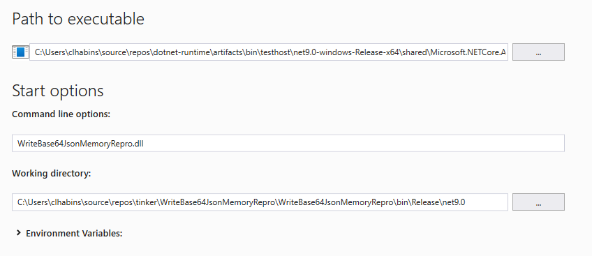
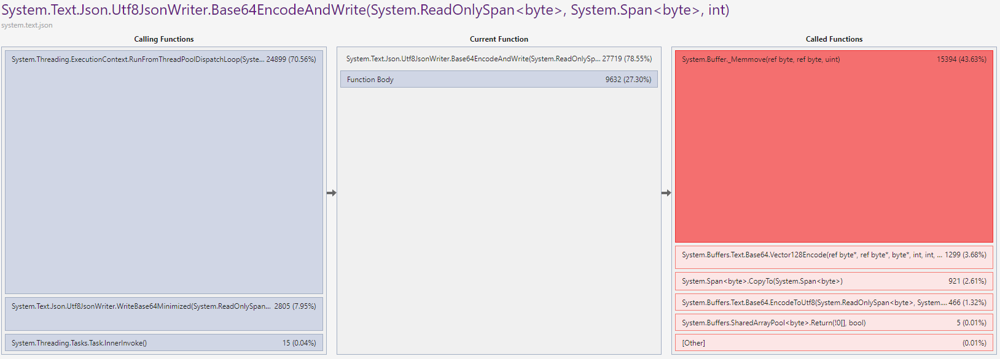
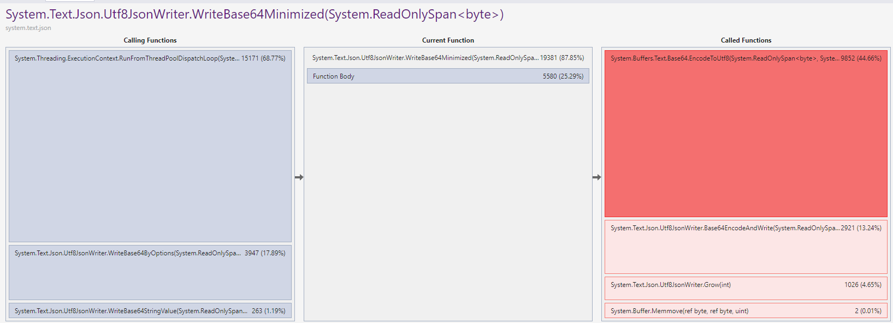
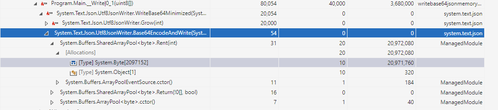
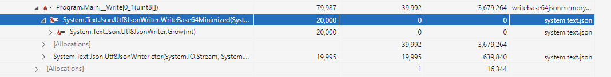

# Unnecessary buffer allocations in Utf8JsonWriter when writing base64 values

This is a sample repro of the issue https://github.com/dotnet/runtime/issues/97628

It's a simple project that demonstrates the allocations in questions. The allocations come from an internal `Base64EncodeAndWrite` helper method.
The method rents a buffer from the shared array pool to write the base64 encoded bytes into and copies the content to the output. This temporary buffer is unnecessary since the encoding
can be done directly into the output buffer.

Since the rented buffer might be reused in subsequent writes, this project performs multiple concurrent write to increasing the likelihood
of the array pool allocating new buffers. This makes it easier to see the problem.

## Setup and profiling

To visualize the issue, you can build the project against a local build of .NET and run the Visual Studio Profile against it.

clone the dotnet runtime repo:

```cmd
git clone https://github.com/dotnet/runtime
```

build the runtime: (took about 20-30min on my machine)

```cmd
build.cmd -c Release
```

This generates build artifacts in a directly like:

```cmd
path\to\runtime\artifacts\bin\testhost\net9.0-windows-Release-x64
```

Copy the sdk tools from `runtime\.dotnet` to the build output so you can use the local dotnet build to build and run projects:

```cmd
cd path\to\runtime\.dotnet
cp -r sdk path\to\runtime\artifacts\bin\testhost\net9.0-windows-Release-x64
cp -r packs path\to\runtime\artifacts\bin\testhost\net9.0-windows-Release-x64
```

Navigate to this repro project's csproj folder:

```cmd
cd experiments/WriteBase64JsonMemoryRepro/WriteBase64JsonMemoryRepro
```

Run/build the project using the local build of dotnet:

```cmd
path\to\runtime\artifacts\bin\testhost\net9.0-windows-Release-x64\dotnet.exe run -c Release
```

Using the guide here to run the Visual Studio profiler:  https://github.com/dotnet/performance/blob/main/docs/profiling-workflow-dotnet-runtime.md

I used the CoreRun option. Using the `corerun.exe` path: `runtime\artifacts\bin\testhost\net9.0-windows-Release-x64\shared\Microsoft.NETCore.App\9.0.0\corerun.exe`


 https://github.com/dotnet/performance/blob/main/docs/profiling-workflow-dotnet-runtime.md

## Results

These are the results before and after the fix

### CPU Before

A lot of CPU time on `Span<byte>.CopyTo()` and `Buffer._Memmove()`



### CPU After

No trace of `Span<byte>.CopyTo()` or `Buffer._Memmove()`



### Allocations Before

Large byte[] allocations from `SharedArrayPool<byte>.Rent` under `Base64EncodeAndWrite`



### Allocations After

No traces of `Base64EncodeAndWrite` in allocations.

